Herramientas y tecnologías
<picture>
  <source media="(prefers-color-scheme: dark)" srcset="https://skillicons.dev/icons?i=python,js,ts,postgres,docker,vscode,nestjs,angular&theme=dark">
  
</picture>
<!--
## Proyectos

Cuando tengas el portfolio y los proyectos subidos, agregalos acá.
Contacto
<a href="https://github.com/SantiagoToniollo" title="Mi GitHub">
  <picture>
    <source media="(prefers-color-scheme: dark)" srcset="https://skillicons.dev/icons?i=github&theme=dark">
    
  </picture>
</a>
<a href="mailto:toniollosantiago@gmail.com" title="Escribime un mail">
  <picture>
    <source media="(prefers-color-scheme: dark)" srcset="https://skillicons.dev/icons?i=gmail&theme=dark">
    
  </picture>
</a>
